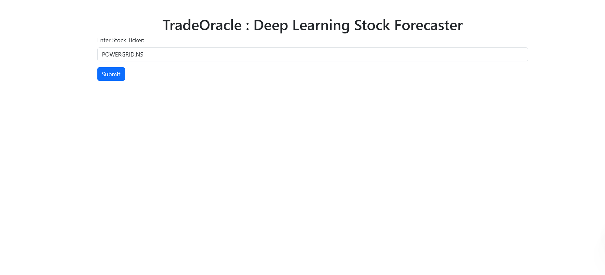
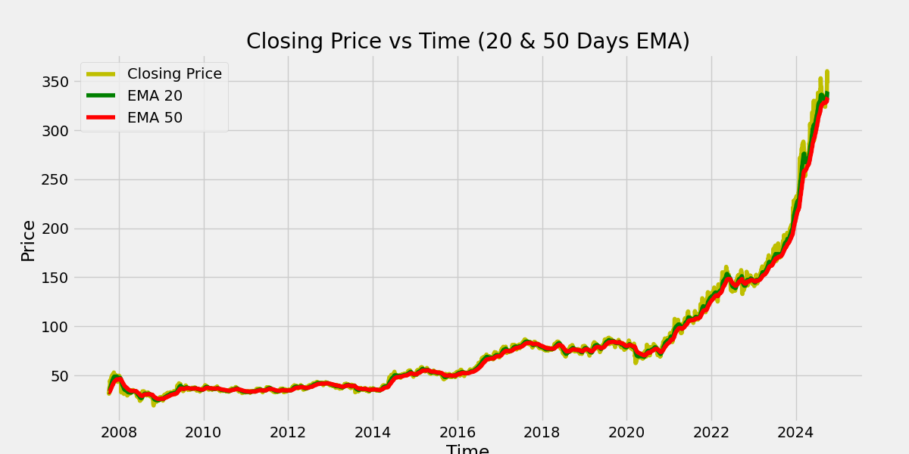
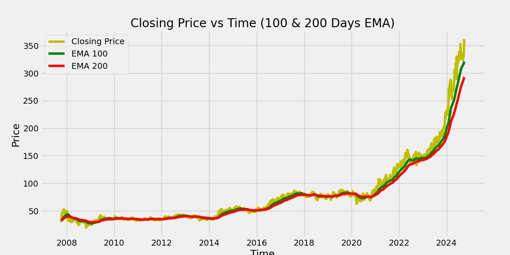
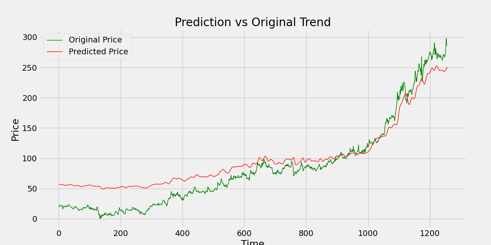
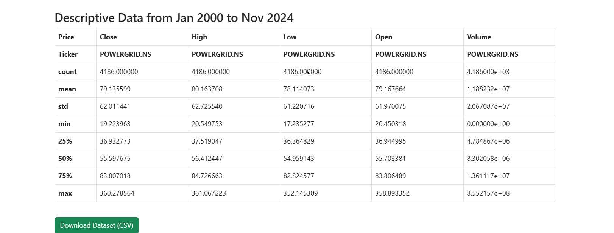

# TradeOracle Deep Learning Stock Forecaster

A deep learning web application that predicts stock prices using historical data. The project focuses on predicting stock prices for AAPL (Apple Inc.) and PowerGrid using a deep learning model built with Keras.

## 📷 Screenshots


*Main prediction interface*





*Example of a prediction result*

## 📋 Overview

This project implements a stock price prediction system using deep learning techniques. The application provides a web interface built with Flask where users can select a stock and get price predictions based on historical data patterns.

## 🚀 Features

- Real-time stock price predictions
- Support for multiple stocks (AAPL and PowerGrid)
- Interactive web interface
- Visualization of historical prices and predictions
- Pre-trained deep learning model
- Easy-to-use prediction interface

## 🛠️ Technologies Used

- Python
- Flask
- TensorFlow/Keras
- Pandas
- NumPy
- HTML/CSS
- JavaScript (for visualizations)

## 📁 Project Structure

```
STOCK_PRICE_PREDICTION/
│
├── static/
│   ├── AAPL_dataset.csv
│   ├── powergrid.csv
│   └── Data.png
│   └── ema_20_50.png
│   └── ema_100_200.png
│   └── Interface.png
│   └── stock_prediction.png
│
├── templates/
│   └── index.html
│
├── app.py
├── README.md
├── requirements.txt
├── Stock Price Prediction.ipynb
└── stock_dl_model.h5
```

## 🔧 Installation

1. Clone the repository:
   ```bash
   git clone https://github.com/Manish-Kumar24/TradeOracle-Deep-Learning-Stock-Forecaster.git
   cd TradeOracle-Deep-Learning-Stock-Forecaster
   ```

2. Create a virtual environment (recommended):
   ```bash
   python -m venv venv
   source venv/bin/activate  # On Windows: venv\Scripts\activate
   ```

3. Install required packages:
   ```bash
   pip install -r requirements.txt
   ```

## 💻 Usage

1. Start the Flask application:
   ```bash
   python app.py
   ```

2. Open your web browser and navigate to:
   ```
   http://localhost:5000
   ```

3. Select a stock (AAPL or PowerGrid) from the dropdown menu and submit to get the prediction.

## 📊 Model Information

The project uses a deep learning model built with the following characteristics:
- Architecture: Sequential model with LSTM layers
- Input: Historical price data with technical indicators
- Output: Future price predictions
- Training data: Historical stock prices from Yahoo Finance
- Model file: `stock_dl_model.h5`

## 📈 Datasets

The project includes two datasets:
- `AAPL_dataset.csv`: Historical data for Apple Inc. stock
- `powergrid.csv`: Historical data for PowerGrid stock

Data includes the following features:
- Date
- Open Price
- Close Price
- High Price
- Low Price
- Volume
- Additional technical indicators

## 🔍 Model Performance

The deep learning model has been trained and evaluated on historical data with the following metrics:
- Mean Squared Error (MSE)
- Root Mean Squared Error (RMSE)
- Mean Absolute Error (MAE)

## 🛟 Error Handling

The application includes error handling for:
- Invalid input data
- Model loading issues
- Prediction errors
- Data preprocessing issues

## 📝 Contributing

1. Fork the repository
2. Create your feature branch (`git checkout -b feature/AmazingFeature`)
3. Commit your changes (`git commit -m 'Add some AmazingFeature'`)
4. Push to the branch (`git push origin feature/AmazingFeature`)
5. Open a Pull Request

## 📄 License

This project is licensed under the MIT License - see the LICENSE file for details.

## 👥 Authors

- Manish Kumar - *Initial work*

## 🙏 Acknowledgments

- Data source: Yahoo Finance
- Libraries used: TensorFlow, Keras, Flask, Pandas, NumPy
- Any other resources or inspirations used in the project